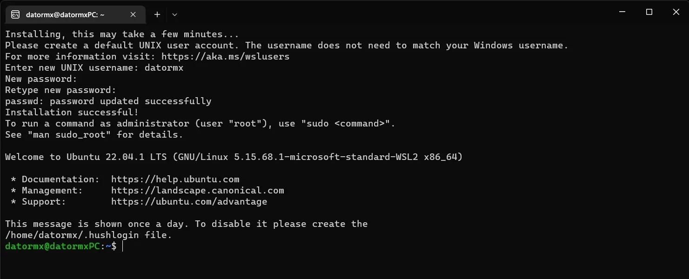
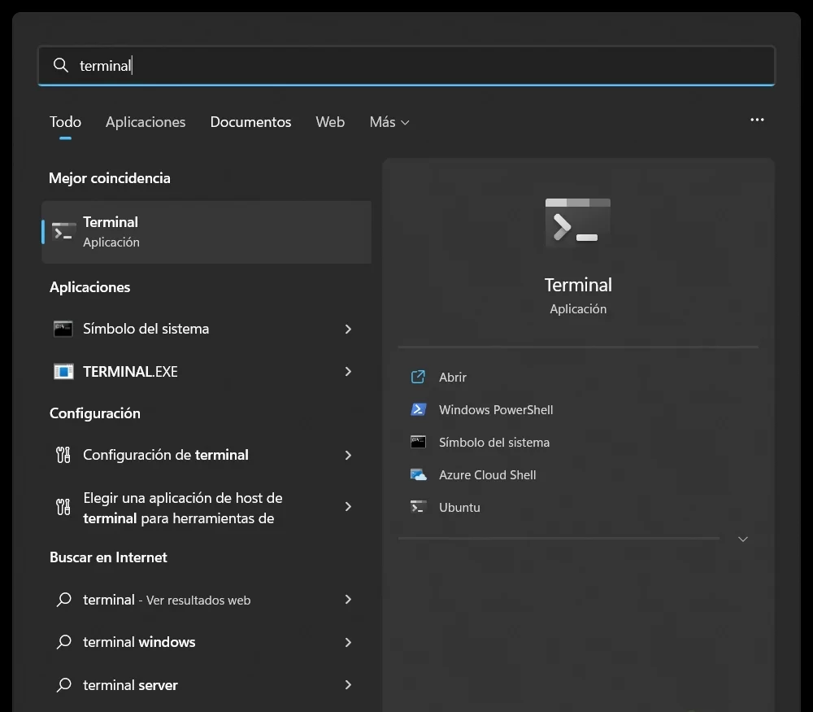
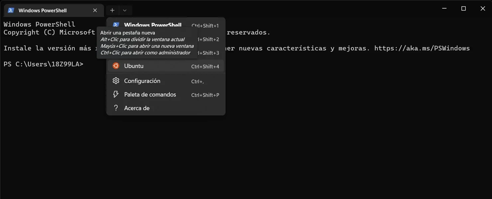
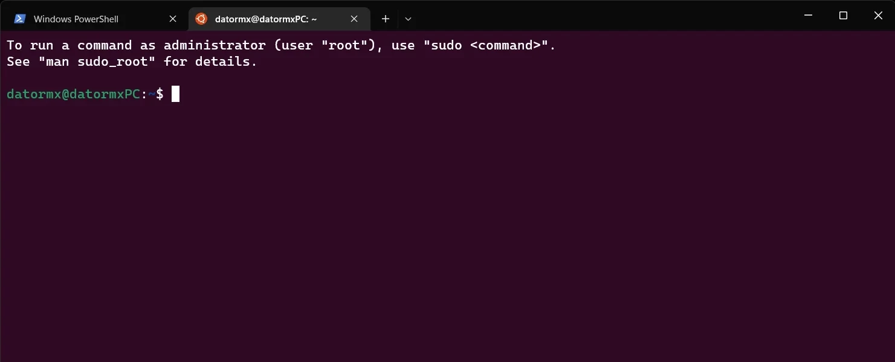
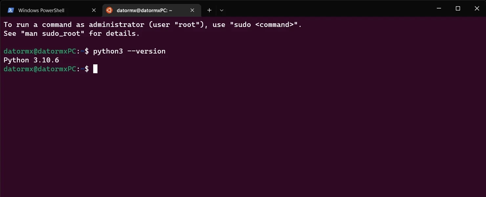
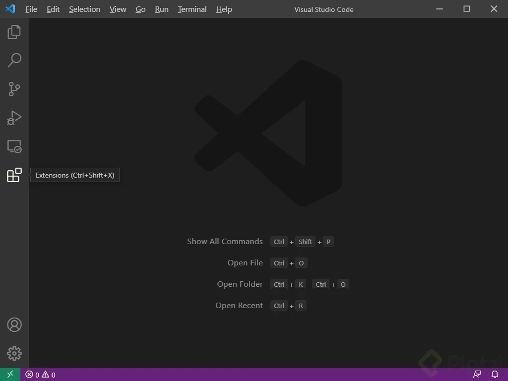
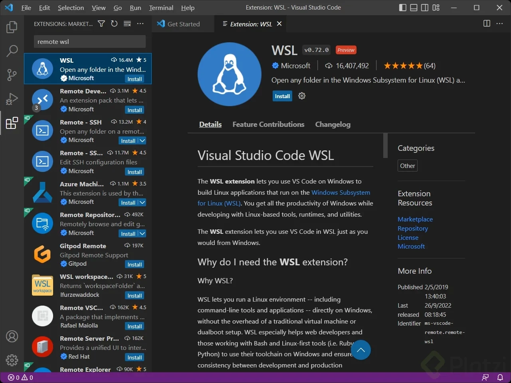
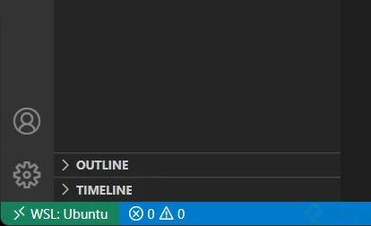

# Instalación de herramientas de trabajo: WSL, Python3

###### MCC. Leonardo Arroyo Lira


Este documento es una guía resumida de varias fuentes para instalar **[WSL (Windows Subsystem for Linux)](https://learn.microsoft.com/es-es/windows/wsl/about)** si estás utilizando Windows 10 o Windows 11. Esta herramienta te permitirá usar una terminal de comandos de Linux desde Windows. Así mismo actualizaremos la versión de python3 e instalaremos VSCode como editor de código.

Saltar el apartado 1 quienes:

1. Usan Linux como sistema operativo de forma nativa en tu computadora.

2. Usan macOS como tu sistema operativo.

3. Ya cuentan con una terminal Linux con WSL en tu Windows.

   

## 1. Instalar WSL y Ubuntu

**WSL** es como tener un kernel con alguna distribución de linux encapsulado corriendo en nuestra computadora con Windows 10 u 11.

Una vez que tienes instalada esta herramienta podrás instalar de las distribuciones de Linux disponibles como Ubuntu o Debian. Para  nuestro curso instalaremos **Ubuntu** que se instala por defecto al instalar WSL, pero puedes escoger alguna otra para trabajos futuros o por la que tengas preferencia y ya sepas utilizar.

**IMPORTANTE**:

> Antes de iniciar debemos estar seguros de que contamos con la actualización adecuada de Windows, tal como lo indica Microsoft en su documentación: *"Para ejecutar los siguientes comandos, debe ejecutar Windows 10 versión  2004 y posteriores (compilación 19041 y posteriores) o Windows 11. Si  está en versiones anteriores, consulte [la página de instalación manual](https://learn.microsoft.com/es-es/windows/wsl/install-manual)."* 

Puedes encontrar mas información en la [documentación oficial de windows](https://learn.microsoft.com/es-mx/windows/wsl/install).

Ahora si, para iniciar con la instalación sigue los siguientes pasos:

1. Abrimos *"Windows PowerShell"* desde inicio en Widows y **Ejecutamos como Administrador**.

   

2. Dentro de Windows PowerShell escribe la siguiente instrucción y presiona la tecla **Enter**:

   ```wsl --install```

3. Espera a que la instalación llegue al 100% y presiona **Enter**. Esto iniciará el proceso de instalación de linux Ubuntu.

   

4. Espera a que la instalación de Ubuntu se complete.

5. Cuando finalizafinalize la instalación reinicia tu computadora para aplicar los cambios.

6. Una vez que se haya reiniciado la computadora iniciará la configuración de Ubuntu.

   

7. Ingresa un **username** y **password**. No pierdas estos datos, ya que son requeridos para muchas acciones en el sistema operativo Linux.

   

8. Hecho lo anterior, ya tienes WSL y Ubuntu instalados en tu computadora con Windows.  Para acceder nuevamente a Ubuntu en WSl abre la aplicación **Terminal** desde inicio de Windows.

   

9. Dentro de **Terminal** da clic en la flecha hacia abajo y elige la opción de **Ubuntu**.

   

   


## 2. Probar y actualizar Ubuntu y Python

Cuando instalamos  Ubuntu por default tendremos una instalación de Python 3 disponible para utilizar.  Para corroborar lo anterior realizamos lo siguiente:

1. Abre la  **Terminal de Ubuntu** que acabas de instalar. A partir de este momento cada que se haga referencia a la terminal Ubuntu ó terminal de Linux, nos referimos a la terminal Ubuntu WSL que instalamos anteriormente. 

2. En la terminal de Ubuntu ejecuta el siguiente comando:

   `python3 --version`

   

   Observa en la imagen que este comando imprimirá en pantalla la versión de python con la que cuentas, esta información puede ser distinta dependiendo de la instalación de cada uno.

   

3. Ahora, haremos una actualización de los repositorios de Ubuntu, para esto ingresa el siguiente comando:

   `sudo apt update`

   

   Los repositorios de Ubuntu, son enlaces a servidores donde se almacenan los paquetes y aplicaciones necesarios para Ubuntu. Es similar a una tienda de aplicaciones.

   

4. Una vez actualizado el repositorio, tenemos la certeza que si instalamos algún paquete o aplicación nueva, obtendremos la ultima actualización.

5. Es posible que existan actualizaciones importantes de tu sistema o aplicaciones instaladas en Ubuntu, para obtenerlas ejecuta el siguiente comando en la terminal de Ubuntu.

   `sudo apt upgrade`

Es recomendable aplicar de vez en cuando los comandos `sudo apt update` y `sudo apt upgrade`  y sobre todo antes de instalar un paquete nuevo, para asegurarnos de mantener nuestro sistema Ubuntu/Linux actualizado.


## 3. Instalar pip3

**pip3** es un manejador de  paquetes y librerías para Python. Con esta herramienta  podrás instalar librerías de terceros como Pandas o Numpy que usarás en  tu día a día como programador con Python. Para instalar esta herramienta haz lo siguiente:

1. Nos aseguramos de que los repositorios estén actualizados con `sudo apt update`

2. Ejecuta en tu terminal el siguiente comando para instalar pip3:

   `sudo apt -y install python3-pip`

   

   

3. Prueba la instalación de pip3 una vez que haya terminado todo el proceso ejecutando el siguiente comando:

   `pip3 --version`

   

   

Con esto comprobamos que ya esta instalado **pip3** en Ubuntu.

## 4. Instalar VSCode

**Visual Studio Code** es un editor de código fuente ligero pero eficaz que se ejecuta en el escritorio y está disponible **para** Windows, macOS y Linux. [https://visualstudio.microsoft.com/es/]

1. [Descarga](https://code.visualstudio.com/) e instala Visual Studio Code en windows. Sigue las instrucciones de la página oficial.


Ahora que tienes tu sistema de Linux en Windows, podrás abrir Visual Studio Code pero deberás hacerlo de una manera distinta para que toda librería o configuración que instales en linux funcione.

1. Busca “Visual Studio Code” desde tu buscador de Windows y ábrelo dando clic en su ícono:

   

2. Una vez abierto VSCode ve al panel izquierdo y da clic en el ícono de extensiones:

   

3. Busca en el menú izquierdo la extensión **WSL** e instálala con el botón azul install:

   

   Adicionalmente ya que trabajaremos con Python, instala algunas extenciones adicionales como: **Python Extension Pack**

4. Escribe el siguiente comando desde tu terminal Ubuntu para abrir VSCode en WSL:

   `code`

Este comando abrirá una versión de VSCode que correrá desde WSL con  el sistema operativo Ubuntu. Esto puedes comprobarlo porque en la parte  inferior izquierda de tu editor verás un recuadro verde que indica que  estás en WSL y qué versión de Linux utilizas:





> Excelente, ya está usando VSCode desde WSL. Recuerda que siempre debes abrir VSCode con el comando `code` desde tu terminal con WSL, de lo contrario te encontrarías utilizando  la versión de tu sistema operativo Windows y no la de tu versión de  Ubuntu Linux en WSL.


------

Con esto finaliza este minitutorial para instalar las herramientas necesarias para programar con Python usando WSL en Windows 10/11.

Si surgen dudas puedes ponerte en contacto conmigo por medio de los foros de la materia.

